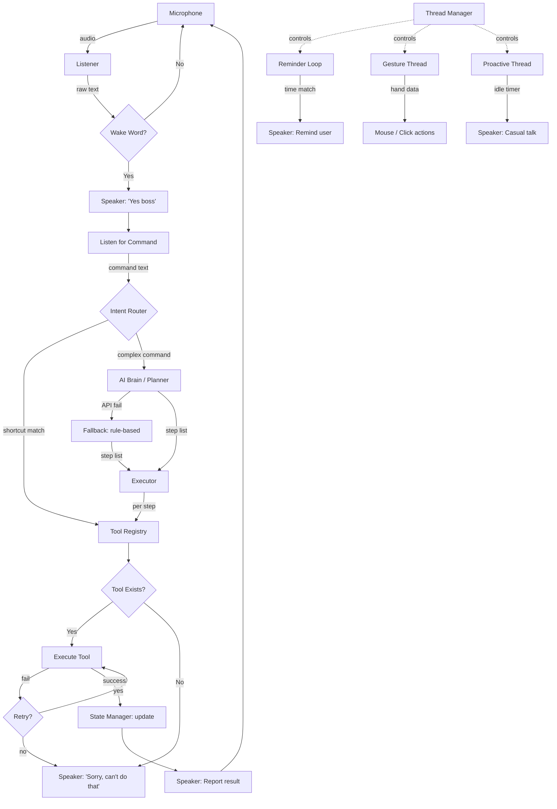

# Wednesday — Complete AI Assistant System Plan

An advanced, Jarvis-like AI assistant built in Python with voice control, gesture control, screen vision, memory, reminders, proactive conversation, and a free AI brain.

---

## Project Architecture

```
wednesday/
├── main.py                    # Entry point — boots all subsystems
├── config.py                  # Global settings & constants
├── state.py                   # [NEW] Tracks last command, last app, context
├── requirements.txt           # All pip dependencies
│
├── voice/                     # Voice I/O subsystem
│   ├── __init__.py
│   ├── listener.py            # Microphone → text (speech_recognition)
│   ├── wake_word.py           # Detects "Hey Wednesday"
│   └── speaker.py             # Text → speech (pyttsx3)
│
├── brain/                     # Intelligence layer
│   ├── __init__.py
│   ├── ai_brain.py            # Free LLM API calls (OpenRouter / HuggingFace)
│   ├── fallback.py            # [NEW] Rule-based responses when AI is down
│   ├── intent_router.py       # [NEW] Fast keyword→action shortcuts (no AI)
│   ├── planner.py             # Command → step-list task planner
│   └── conversation.py        # Proactive / idle conversation engine
│
├── executor/                  # [NEW] Step-by-step plan runner
│   ├── __init__.py
│   └── executor.py            # Execute plan steps, per-step error handling
│
├── tools/                     # Executable tool functions
│   ├── __init__.py
│   ├── registry.py            # Tool name → function mapping
│   ├── app_launcher.py        # Open apps (Notepad, VS Code, etc.)
│   ├── browser.py             # Open websites, search Google/YouTube
│   ├── file_manager.py        # Create/read/delete files & folders
│   └── automation.py          # Mouse clicks, keyboard typing (pyautogui)
│
├── vision/                    # Screen understanding
│   ├── __init__.py
│   ├── screenshot.py          # Capture screen (Pillow)
│   └── ocr.py                 # Extract text from screen (pytesseract)
│
├── memory/                    # Persistent user memory
│   ├── __init__.py
│   ├── memory.py              # Read/write memory.json
│   └── memory.json            # Stored user data (name, prefs, etc.)
│
├── reminders/                 # Reminder subsystem
│   ├── __init__.py
│   ├── reminder.py            # Reminder loop + follow-up logic
│   └── reminders.json         # Active reminders store
│
├── gesture/                   # Camera gesture control
│   ├── __init__.py
│   ├── hand_tracker.py        # MediaPipe hand landmark detection
│   └── gesture_mapper.py      # Map gestures → mouse/scroll actions
│
└── utils/                     # Shared helpers
    ├── __init__.py
    ├── logger.py              # Simple console logger with timestamps
    └── thread_manager.py      # [NEW] Safe start/stop for background threads
```

---

## System Flow



**Boot sequence (`main.py`):**
1. Initialize speaker, listener, memory, reminders, **state manager**
2. **Thread manager** starts background threads: reminder loop, proactive conversation
3. Enter main voice loop: listen → wake word → **intent router** (shortcut or AI) → **executor** → speak result
4. Gesture control starts/stops via voice command (managed by **thread manager**)

---

## Phased Development Plan

### Phase 1 — Core Voice Assistant

| File | Purpose |
|---|---|
| `voice/speaker.py` | `speak(text)` using pyttsx3 — converts text to speech |
| `voice/listener.py` | `listen()` using speech_recognition — returns text from mic |
| `voice/wake_word.py` | `is_wake_word(text)` — checks if input starts with "hey wednesday" |
| `main.py` | Main loop: listen → wake word check → respond "Yes boss" → listen for command |
| `config.py` | Wake word, assistant name, voice settings |
| `requirements.txt` | Initial dependencies |

**Outcome:** Say "Hey Wednesday" → assistant replies "Yes boss, how can I help you?" and listens for a command.

---

### Phase 2 — Command Execution + Intent Shortcuts + Executor

| File | Purpose |
|---|---|
| `brain/intent_router.py` | **[NEW]** Keyword-matching shortcut table. Simple commands ("open notepad", "open youtube") bypass AI entirely and map directly to a tool call. Only unmatched / complex commands go to AI planner. |
| `executor/executor.py` | **[NEW]** `run_plan(steps)` — iterates over step list, calls tool registry per step, catches exceptions per step, retries once on failure, logs results. |
| `state.py` | **[NEW]** `StateManager` — singleton tracking `last_command`, `last_app`, `last_result`, `context` dict. Updated after every execution. |
| `tools/registry.py` | Dictionary mapping tool names → functions |
| `tools/app_launcher.py` | `open_app(name)` — launches apps via `subprocess` / `os.startfile` |
| `tools/browser.py` | `open_website(url)`, `search_google(query)`, `search_youtube(query)` |
| `tools/file_manager.py` | `create_file()`, `read_file()`, `delete_file()`, `list_files()` |

**Intent shortcut example:**
```
User says: "open youtube"
→ intent_router finds keyword match → [{"tool": "open_website", "args": {"url": "https://youtube.com"}}]
→ Executor runs it directly — no AI API call needed
```

**Outcome:** Simple commands execute instantly via shortcuts; complex commands go through the AI planner.

---

### Phase 3 — AI Task Planner + Error Handling + Fallback

| File | Purpose |
|---|---|
| `brain/ai_brain.py` | `ask_ai(prompt)` — tries OpenRouter first, falls back to HuggingFace. **Retry once** on transient errors (timeout, 5xx). If both APIs fail after retry, hands off to `fallback.py`. |
| `brain/fallback.py` | **[NEW]** `fallback_response(command)` — rule-based response engine. Pattern-matches common intents (open app, search, time, weather placeholder) and returns a best-effort step list or a spoken apology. The assistant **never goes silent**. |
| `brain/planner.py` | `plan_task(command)` — sends command to AI with a system prompt that forces JSON step output. Parses result into a list of `{tool, args}` dicts. On parse failure, retries once with a stricter prompt. |

**Error handling flow:**
```
command → ai_brain.ask_ai()
  ├─ success → parse steps → executor
  ├─ fail (retry 1) → ai_brain.ask_ai()
  │    ├─ success → parse steps → executor
  │    └─ fail → fallback.fallback_response()
  │         ├─ pattern match → execute directly
  │         └─ no match → speak "Sorry boss, samajh nahi aaya"
```

**Example:**
```
Input:  "Open YouTube and play a Python video"
Output: [
  {"tool": "open_browser", "args": {"url": "https://youtube.com"}},
  {"tool": "search_youtube", "args": {"query": "python tutorial"}},
  {"tool": "click_first_result", "args": {}}
]
```

> [!IMPORTANT]
> You will need a **free API key** from [OpenRouter](https://openrouter.ai/) or [HuggingFace](https://huggingface.co/). I will prompt you for the key at the start of Phase 3 coding.

---

### Phase 4 — Automation (Mouse + Keyboard)

| File | Purpose |
|---|---|
| `tools/automation.py` | `click(x, y)`, `type_text(text)`, `press_key(key)`, `scroll(amount)`, `move_mouse(x, y)` — all via pyautogui |

**Outcome:** AI planner can include automation steps like "click at position (500, 300)" or "type hello into the search box".

---

### Phase 5 — Screen Vision

| File | Purpose |
|---|---|
| `vision/screenshot.py` | `take_screenshot()` — captures full screen with Pillow, saves to temp file |
| `vision/ocr.py` | `read_screen_text()` — runs pytesseract on the screenshot, returns extracted text |

> [!IMPORTANT]
> **Tesseract OCR** must be installed separately on your system. I will guide you through installing it on Windows.

**Outcome:** "What's on my screen?" → assistant screenshots, extracts text, and speaks it back.

---

### Phase 6 — Memory System

| File | Purpose |
|---|---|
| `memory/memory.py` | `save(key, value)`, `recall(key)`, `list_all()` — reads/writes `memory.json` |

**Data format:**
```json
{
  "name": "Vishesh",
  "favorite_editor": "VS Code",
  "language": "Python",
  "notes": ["likes dark mode", "prefers Hindi greetings"]
}
```

**Outcome:** "Remember my name is Vishesh" → saved. "What's my name?" → "Your name is Vishesh, boss."

---

### Phase 7 — Reminder System

| File | Purpose |
|---|---|
| `reminders/reminder.py` | `set_reminder(text, time)`, `check_reminders()` (runs in background thread every 30s) |
| `reminders/reminders.json` | Persistent store of reminders with status |

**Behavior:**
- "Remind me to drink water at 3 PM" → saved
- At 3 PM → speaks: "Boss, reminder: drink water"
- Then asks: "Kya aapne complete kiya?" — repeats if not confirmed

---

### Phase 8 — Proactive Conversation

| File | Purpose |
|---|---|
| `brain/conversation.py` | `maybe_speak()` — if user hasn't interacted for N minutes, say something casual |

**Examples:**
- "Boss, kuch kaam hai?"
- "Agar free ho toh batao, main help kar doon"
- Time-aware: "Good morning boss!" / "Late night coding, sir?"

---

### Phase 9 — Gesture Control (Enhanced Safety)

| File | Purpose |
|---|---|
| `gesture/hand_tracker.py` | Uses OpenCV + MediaPipe to detect 21 hand landmarks from webcam |
| `gesture/gesture_mapper.py` | Maps landmark positions to actions |
| `utils/thread_manager.py` | **[NEW]** `ThreadManager` — register, start, stop, and health-check named daemon threads. Used for gesture, reminder, and proactive threads. |

**Gesture table:**

| Gesture | Action |
|---|---|
| Index finger movement | Move mouse cursor |
| Thumb + Index touch | Left click |
| Double tap in air | Right click |
| Middle finger gesture | Middle click |
| Pinch (thumb + index) | Zoom in/out (scroll) |

**Safety & stability features:**
- **Exponential smoothing** (α = 0.3) on cursor position — prevents jitter
- **Click cooldown** — minimum 400 ms between consecutive clicks
- **Gesture confidence threshold** — MediaPipe confidence must be ≥ 0.7 to register
- **Accidental click guard** — gesture must be held for ≥ 2 consecutive frames to trigger
- **Thread manager** — gesture thread can be cleanly started/stopped without orphan processes

**Voice toggle:**
- "Start gesture control" → `thread_manager.start('gesture')` → camera thread starts
- "Stop gesture control" → `thread_manager.stop('gesture')` → camera thread stops cleanly

---

## Tech Stack Summary

| Component | Library | Cost |
|---|---|---|
| Text-to-Speech | pyttsx3 | Free |
| Speech-to-Text | SpeechRecognition (Google) | Free |
| AI Brain | OpenRouter / HuggingFace API | Free tier |
| Automation | pyautogui + keyboard | Free |
| Screenshots | Pillow | Free |
| OCR | pytesseract (+ Tesseract binary) | Free |
| Hand Tracking | mediapipe + opencv-python | Free |
| Memory/Reminders | JSON files | Free |
| Threading | Python stdlib `threading` | Free |

---

## Personality Quick-Reference

| Situation | Response style |
|---|---|
| Wake word detected | "Yes boss 😄, how can I help you?" |
| Task completed | "Done sir!", "Ho gaya boss!" |
| Task in progress | "Main kar rahi hoon...", "Working on it, sir" |
| Hindi input | Reply in Hinglish naturally |
| Error / failure | "Sorry boss, ye nahi ho paaya. Dobara try karein?" |
| Proactive (idle) | "Kuch kaam hai boss?", "Good morning sir!" |

---

## Verification Plan

Since this is a desktop voice/gesture application (not a web app), verification is **manual** at each phase:

### Phase 1 — Voice
1. Run `python main.py`
2. Say "Hey Wednesday" into mic → expect "Yes boss, how can I help you?" spoken back
3. Say a random sentence → expect it printed to console

### Phase 2 — Commands
1. Say "Open Notepad" → Notepad should launch
2. Say "Open YouTube" → browser should open youtube.com

### Phase 3 — AI Planner
1. Say "Open YouTube and search for Python tutorial" → should open browser, navigate, and search
2. Check console for the step-list JSON the planner produced

### Phase 4 — Automation
1. Say "Click at 500 300" → cursor should move and click
2. Say "Type hello world" → text should be typed

### Phase 5 — Screen Vision
1. Say "What's on my screen?" → should take screenshot + speak extracted text

### Phase 6 — Memory
1. Say "Remember my name is Vishesh" → "Saved, boss"
2. Say "What's my name?" → "Vishesh"

### Phase 7 — Reminders
1. Say "Remind me to take a break in 1 minute" → after 1 min, should speak reminder
2. Confirm or ignore → should follow up

### Phase 8 — Proactive
1. Stay idle for configured timeout → should hear a casual greeting

### Phase 9 — Gesture
1. Say "Start gesture control" → webcam window should open
2. Move hand → cursor should move smoothly
3. Pinch thumb + index → should register left click
4. Say "Stop gesture control" → webcam should close
