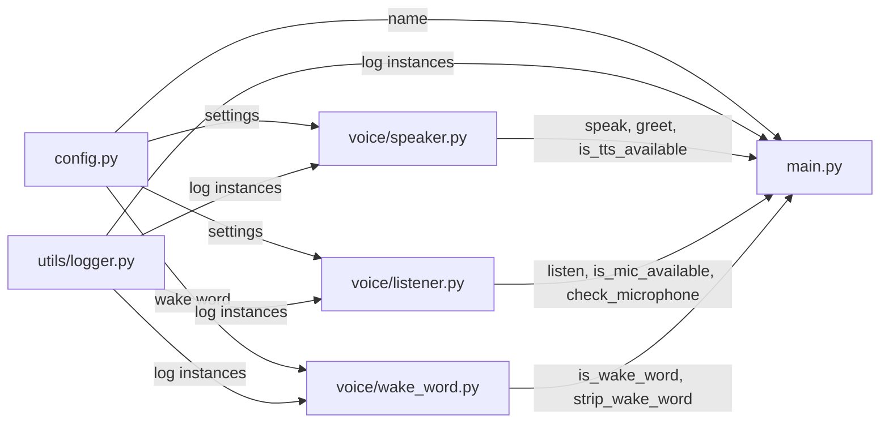

# Phase 1 Walkthrough — Core Voice Assistant

## 📂 Files Created

| File | Purpose |
|---|---|
| [config.py](file:///c:/Users/Vishesh/Documents/AI%20Assitet/wednesday/config.py) | All settings (voice rate, wake word, safe mode, API keys) |
| [requirements.txt](file:///c:/Users/Vishesh/Documents/AI%20Assitet/wednesday/requirements.txt) | pip dependencies |
| [utils/logger.py](file:///c:/Users/Vishesh/Documents/AI%20Assitet/wednesday/utils/logger.py) | Console + rotating file logger |
| [voice/speaker.py](file:///c:/Users/Vishesh/Documents/AI%20Assitet/wednesday/voice/speaker.py) | Text-to-speech with error handling |
| [voice/listener.py](file:///c:/Users/Vishesh/Documents/AI%20Assitet/wednesday/voice/listener.py) | Microphone input with mic detection |
| [voice/wake_word.py](file:///c:/Users/Vishesh/Documents/AI%20Assitet/wednesday/voice/wake_word.py) | Wake word detection with fuzzy matching |
| [main.py](file:///c:/Users/Vishesh/Documents/AI%20Assitet/wednesday/main.py) | Entry point with health checks + voice loop |

---

## 🧩 How Each File Works

### 1. [config.py](file:///c:/Users/Vishesh/Documents/AI%20Assitet/wednesday/config.py) — The Brain's Settings

Stores every tunable constant. No other file has hardcoded values.

- `WAKE_WORD = "hey wednesday"` — the trigger phrase
- `VOICE_RATE = 170` — how fast Wednesday speaks
- `VOICE_INDEX = 1` — selects female voice
- `LISTEN_TIMEOUT = 5` — seconds to wait for speech
- `LISTEN_LANGUAGE = "en-IN"` — Hindi + English mixed
- `WAKE_RESPONSES` — list of greetings like "Yes boss!"
- `SAFE_MODE`, `DANGEROUS_TOOLS` — for Phase 2+ safety
- `LOG_FILE`, `LOG_TO_FILE` — logger settings

### 2. [utils/logger.py](file:///c:/Users/Vishesh/Documents/AI%20Assitet/wednesday/utils/logger.py) — The Logging System

Every module calls [get_logger("name")](file:///c:/Users/Vishesh/Documents/AI%20Assitet/wednesday/utils/logger.py#12-49) to get a logger. Output goes to:
- **Console** — colored INFO+ messages
- **File** (`wednesday.log`) — DEBUG+ messages, rotating at 1 MB with 3 backups

### 3. [voice/speaker.py](file:///c:/Users/Vishesh/Documents/AI%20Assitet/wednesday/voice/speaker.py) — Text-to-Speech

- Initializes `pyttsx3` inside a `try/except` — if TTS fails, sets `_tts_available = False`
- [speak(text)](file:///c:/Users/Vishesh/Documents/AI%20Assitet/wednesday/voice/speaker.py#37-66) — speaks text aloud. If TTS crashes mid-session, it **reinitializes the engine**. If that also fails, it **prints to console** ([_fallback_print](file:///c:/Users/Vishesh/Documents/AI%20Assitet/wednesday/voice/speaker.py#68-71))
- [greet()](file:///c:/Users/Vishesh/Documents/AI%20Assitet/wednesday/voice/speaker.py#73-79) — picks a random greeting from `config.WAKE_RESPONSES`
- [is_tts_available()](file:///c:/Users/Vishesh/Documents/AI%20Assitet/wednesday/voice/speaker.py#81-84) — used by [main.py](file:///c:/Users/Vishesh/Documents/AI%20Assitet/wednesday/main.py) in health checks

### 4. [voice/listener.py](file:///c:/Users/Vishesh/Documents/AI%20Assitet/wednesday/voice/listener.py) — Microphone Input

- At import time, checks `sr.Microphone.list_microphone_names()` — if empty, sets `_mic_available = False`
- [listen(timeout, phrase_limit)](file:///c:/Users/Vishesh/Documents/AI%20Assitet/wednesday/voice/listener.py#51-100) — opens mic, records audio, sends to **Google Speech API** (free), returns lowercase text or `None`
- **6 error handlers**: `WaitTimeoutError`, `UnknownValueError`, `RequestError`, `OSError` (mic disconnected), and generic `Exception`
- [check_microphone()](file:///c:/Users/Vishesh/Documents/AI%20Assitet/wednesday/voice/listener.py#33-44) — returns diagnostic dict `{available, devices}`
- [is_mic_available()](file:///c:/Users/Vishesh/Documents/AI%20Assitet/wednesday/voice/listener.py#46-49) — used by [main.py](file:///c:/Users/Vishesh/Documents/AI%20Assitet/wednesday/main.py) in health checks

### 5. [voice/wake_word.py](file:///c:/Users/Vishesh/Documents/AI%20Assitet/wednesday/voice/wake_word.py) — Wake Word Detection

- [is_wake_word(text)](file:///c:/Users/Vishesh/Documents/AI%20Assitet/wednesday/voice/wake_word.py#12-46) — checks if text starts with "hey wednesday" or common mis-hearings: "he wednesday", "hay wednesday", "hey wensday", etc.
- [strip_wake_word(text)](file:///c:/Users/Vishesh/Documents/AI%20Assitet/wednesday/voice/wake_word.py#48-59) — removes the wake word prefix to extract the command. E.g. `"hey wednesday open notepad"` → `"open notepad"`

### 6. [main.py](file:///c:/Users/Vishesh/Documents/AI%20Assitet/wednesday/main.py) — The Heart

```
Boot → startup_checks() → voice loop
```

**Startup checks:**
1. Tests TTS — if failed, warns but continues (console fallback)
2. Tests Microphone — if missing, **exits with error message**

**Voice loop (runs forever):**
1. [listen()](file:///c:/Users/Vishesh/Documents/AI%20Assitet/wednesday/voice/listener.py#51-100) → get text from mic
2. [is_wake_word(text)](file:///c:/Users/Vishesh/Documents/AI%20Assitet/wednesday/voice/wake_word.py#12-46) → if no, ignore and loop back
3. [greet()](file:///c:/Users/Vishesh/Documents/AI%20Assitet/wednesday/voice/speaker.py#73-79) → speak "Yes boss!"
4. [strip_wake_word(text)](file:///c:/Users/Vishesh/Documents/AI%20Assitet/wednesday/voice/wake_word.py#48-59) → check if command was included
5. If no command included → [speak("Bataiye...")](file:///c:/Users/Vishesh/Documents/AI%20Assitet/wednesday/voice/speaker.py#37-66) → [listen()](file:///c:/Users/Vishesh/Documents/AI%20Assitet/wednesday/voice/listener.py#51-100) again
6. Echo the command back (Phase 2 will route it to tools)
7. `KeyboardInterrupt` → graceful shutdown
8. Any other `Exception` → speak error, continue loop (never crash)

---

## 🔗 How Files Connect Together



---

## 🔧 Exact Setup Steps

### Step 1: Open terminal in the project folder

```bash
cd "c:\Users\Vishesh\Documents\AI Assitet\wednesday"
```

### Step 2: Install all dependencies

```bash
pip install pyttsx3 SpeechRecognition pyaudio
```

> [!WARNING]
> **If `pip install pyaudio` fails** on Windows, use one of these alternatives:
> ```bash
> # Option A: pipwin
> pip install pipwin
> pipwin install pyaudio
>
> # Option B: Download wheel manually
> # Go to https://www.lfd.uci.edu/~gohlke/pythonlibs/#pyaudio
> # Download PyAudio matching your Python version
> # Then: pip install PyAudio‑0.2.14‑cp311‑cp311‑win_amd64.whl
> ```

### Step 3: Run the assistant

```bash
python main.py
```

### Step 4: Test it

1. You should see startup health checks in the console
2. Wednesday will say: *"Hello boss! Wednesday is now online."*
3. Say **"Hey Wednesday"** → should reply *"Yes boss, how can I help you?"*
4. Say any sentence → should echo it back

---

## 🛡️ Error Handling Summary

| Scenario | What happens |
|---|---|
| No microphone connected | Startup check fails → speaks error → exits cleanly |
| Mic disconnects mid-session | `OSError` caught → returns `None` → loops back |
| TTS engine fails to init | Falls back to console printing (`🔇 [Wednesday]: ...`) |
| TTS crashes mid-speak | Reinitializes engine; if fails again → console fallback |
| Google Speech API down | `RequestError` caught → returns `None` → loops back |
| Speech not understood | `UnknownValueError` caught → returns `None` → loops back |
| No speech detected (silence) | `WaitTimeoutError` caught → loops back silently |
| Any unexpected error in loop | Caught by generic `Exception` → speaks apology → continues |
| User presses Ctrl+C | `KeyboardInterrupt` → speaks goodbye → exits cleanly |

**The assistant never crashes. It always responds or silently retries.**
